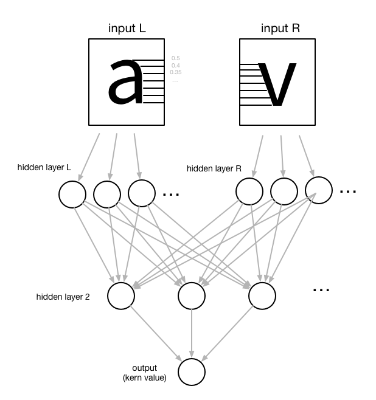

Atokern
=======

A neural network for kerning fonts. (It doesn't work well yet.)

## Requirements

The following libraries need to be installed with pip:

* `tensorflow`
* `freetype`
* `numpy`

You also need the kerning dump script from Adobe type tools:
https://github.com/adobe-type-tools/kern-dump

## Idea

A kerning value is determined by the relative shapes of the left and right boundaries of a glyph pair. So we sample the distance from the boundary to the outline and use that as input to a hidden layer, so that the NN gets a feel for what is important in a glyph's outline. Do this for both the left and right glyphs (on the right, sample the distance from the left boundary, obviously).

The left and right hidden layers are then both used as input to a second hidden layer, and then we derive the kerning value from that:

## Training

Place a bunch of font files (I figure fairly similar ones should be useful, like grotesque sans) into a directory called `kern-dump`, and dump all their kern pairs:

    for i in kern-dump/*.otf ; python dumpkerning.py  $i

Then run:

    python atokern.py

## Predicting

We'll get to this when training actually works. :/

